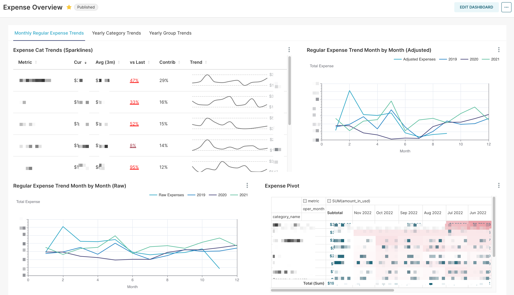
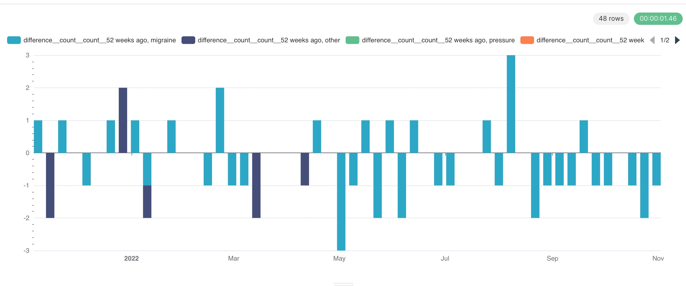

# Perlovs [or personal] analytics hub aka PAH

This is my own personal home PI (as in - personal intelligence) system. It is not entirely unlike [enterprise BI](https://en.wikipedia.org/wiki/Business_intelligence).

It is potentially intentionally over-engineered, because apparently like to have ~~pain~~ fun with OSS.

Currently it consists of:
* Custom built python based package & cli to load sources (Airflow - I am looking at you)
    * Reads CPI data from [BLS](https://www.bls.gov/)
    * Loads exchange rates from [ECB](https://www.ecb.europa.eu/) and [cryptocompare](https://www.cryptocompare.com/)
    * Loads my personal financial data from [drebedengi](https://drebedengi.ru/) using python [API wrapper](https://pypi.org/project/drebedengi-python-api/) I wrote
    * Loads my family headache and other diaries that we track using another project of mine: [NerdDiary Server](https://github.com/mishamsk/nerddiary) and telegram bot that is yet to be open sourced
* [dbt](https://docs.getdbt.com) to transform data
* [Apache Superset](https://superset.apache.org) to visualize data
* A bunch of scripts, dockerfiles & one big fat [docker-compose](https://docs.docker.com/compose/) file to run everything

If by any chance you are using Drebedengi and/or NerdDiary, or you want a template to build your own PAH, read on how to spin this up.

## So what kind of intelligence can I get from this?

I am still building out dashboards, but here are  two examples.

My financial overview dashboard (hope the upward cost trend is not due to dockers eating too much energy):

YoY trend from my headache diary:

## How to run

⚠️ **IMPORTANT**: It is not secured and uses standard passwords and secrets (although you can change that) => NEVER EVER EXPOSE THIS TO INTERNET.⚠️

Let me repeat: NEVER EVER...EVER EXPOSE THIS TO INTERNET. Better use [tailscale](https://tailscale.com) or something similar to access it from outside.

I am not responsible for any damage this might cause to your machine or data.

### Prerequisites

I am running it on my Macbook Pro (for development) and on my Synology NAS (for production). So it should probably work on any *nix environment, but I have not tested it.

I assume you know basic docker and docker-compose. If not, please read [this](https://docs.docker.com/compose/gettingstarted/) and [this](https://docs.docker.com/get-started/).

### Deploying

You will need to:
* Make a copy of .env.sample and rename it to .env
* Fill in all the variables in .env (although most have defaults buried in docker-compose.yml and scripts, but it is better to be explicit)
* Run `source .env` to load all the variables into your environment
* Run `make docker-reset` or `scripts/reset_and_init.sh` to build and run all the containers

Voila! You should be able to access Superset at http://localhost:8088 (or whatever you set SUPERSET_PORT to in .env)

In order to see example dashboards, you will need to log in as admin and import them using `superset/backups/export_assets.zip` backup.
